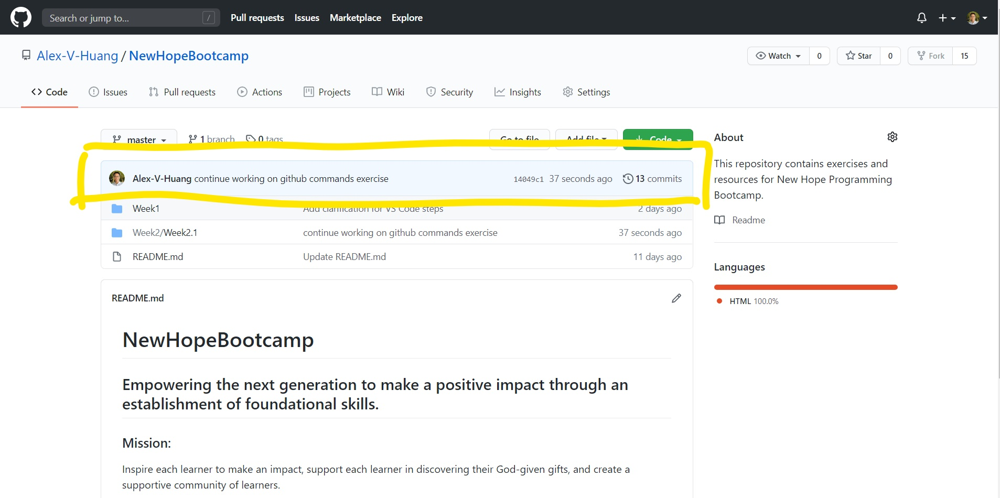

# Git Commands

## Checking Your Repository's Status
- Checking the status of your repository reveals the current state of your repository.
- This is accomplished by running ```git status``` in a repository in your command line.
- ```git status``` can be run at any point when you are making changes to a repository. If you are in a sticky situation, checking the status of your repository can help you discover what to do next.

## Making Changes to Your Repository
- There are three steps to follow when making changes to your repository. These are adding, committing and pushing your changes.

1. The first thing to do is to check the status of our repository.

- Run ```git status```. This may reveal a list of changed or "untracked" files in red, as well what to do next.


In this case, my Week2 folder is untracked and needs to be added to the repository.

2. Files are added to a repository using the ```git add``` command. There are two ways of using this command:

- All untracked files can be added using the first method. Run ```git add .```. This is useful if you know you want all of your changed files to be added to your repository. (RECOMMENDED)


- Files can also be added one by one. This can be done by running ```git add [your-file-name]```. This is useful if there are certain changed files that you do not want to save in your repository.

3. Let's check the status of our repository now.

- Run ```git status```. This will reveal a list of added files in green, as well what to do next.


In this case, three files have been added and are ready to be committed to the repository.

4. Now that your changed files are added, they are ready to be saved or committed to your repository's database on GitHub. Commits include a short message detailing the changes made to your repository.

- Run ```git commit -m "your-message-here"```. Make sure to add a relevant message that helps remind yourself what changes you are making to your repository.


In this case, four files have been successfully committed to the repository.

5. Let's check on our repository's status again.

- Run ```git status```. This will reveal a message stating there is a commit(s) ready to be published or "pushed".


In this case, three files have been added and are ready to be committed to the repository.

6. Finally, you are ready to publish or "push" your changes onto GitHub, your repository's database.

- Run ```git push```. If successful, a message similar to this one will appear.


The message also includes the URL of your repository stored on GitHub.

7. To double check you successfully published your changes, visit our repository on GitHub.



Your latest published change is in light blue, along with the message you attached to it and a timestamp.

- If you are interested in your latest commit, you can click on the message to reveal exactly which lines of code you changed.

- If you are interested in your commit history, click on the total number of commits to view all of your commits to your repository.
